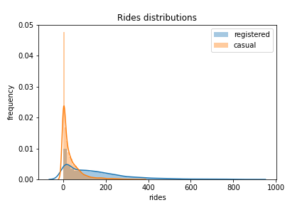
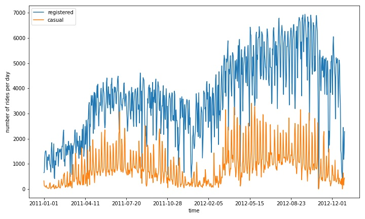
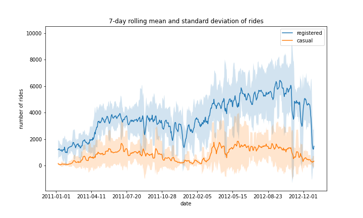
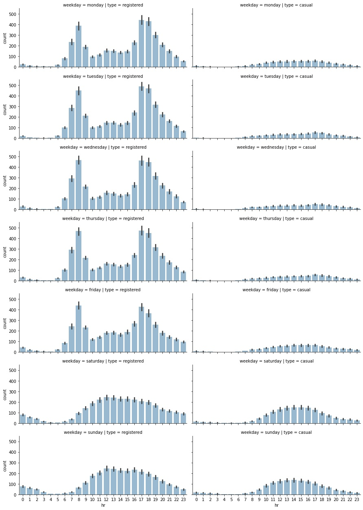
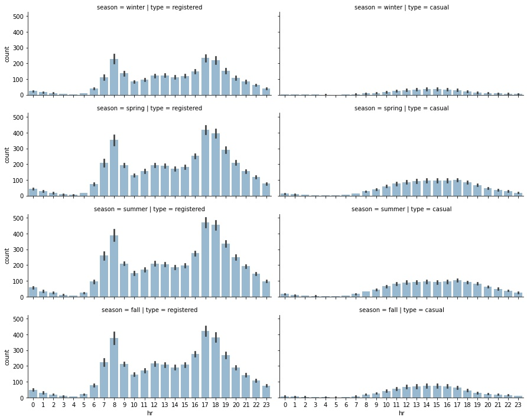
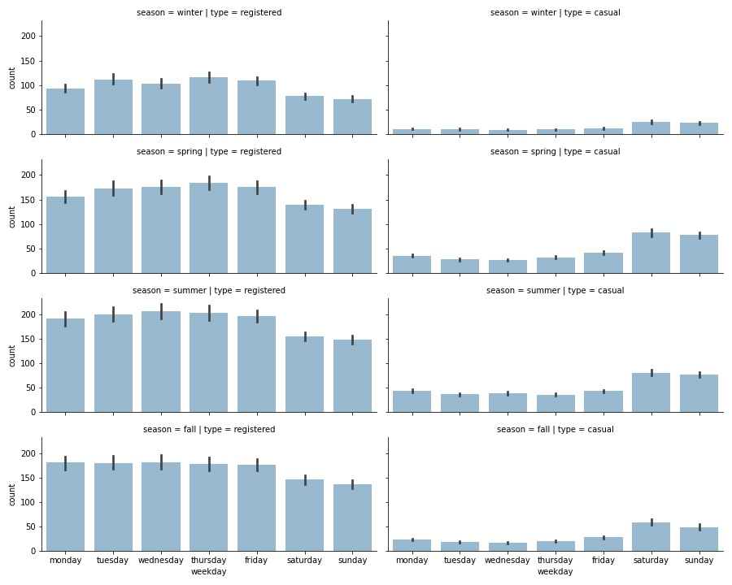

# Bike Sharing Analysis

Bike sharing is a fundamental service, commonly used in the urban mobility sector. it is easily accessible (as no driving license is required to ride a bike), cheaper than normal car sharing service (since bike maintenance and insurance are substantially cheaper than automobile ones), and, finally, is often a fast way to commute within the city. Therefore, understanding the driving factors of bike sharing requests is essential for both companies and users.

From a company's perspective, identifying the expected bike demand in a specific area, within a specific time frame, can significantly increase revenue and customer satisfaction. Moreover, bike relocation can be optimized to further reduce operational costs. From a user's perspective, probable the most important factor is bike availability in the shortest wait time, which is obviously in alignment with the company's interests.

## Project Objective
In this project, I will analyze bike sharing data from Capital Bikeshare Washington, D.C., USA, for the period between January 1, 2011, and December 21, 2012. The data is aggregated on an hourly basis. This means that no initial and final locations of the individual rides are available, but only the total number of rides per hour. Nevertheless, additional meteorological information is available in the data, which could serve as a driving factor for identifying the total number of requests for a specific time frame (bad weather conditions could have a substantial impact on bike sharing demand).

Although the conducted analysis is related to bike sharing, the provided techniques could be easily transferred to other types of sharing business models, such as car or scooter sharing.

## Dataset
The original dataset is available at https://archive.ics.uci.edu/ml/datasets/Bike+Sharing+Dataset#.

According to the description of the original data, provided in the [Readme.txt](data/README.txt), the columns can be split into three main groups:
- **tems**:htains information about the time at which the record was registered. This group contains the **dteday, season, yr, mnth, hr, holiday, weekday** and **workingday** columns.
- **weather related features**: This contains information about the weather conditions. The **weathersit, temp, atemp, hum** and **windspeed** columns are included in this group.
- **record related features**: This contains information about the number of records for the specific hour and date. This group included the **casual, registered** and **cnt** columns.

> Note: **instant** wasn't included in any of the aforementioned groups. The reason for this is that it is an index column and will be exluded from the analysis, as it does not contain any information relevant to this analysis.

### Preprocessing Details
1. `seasons`: each of the four divisions of the year
    - `1`: Windter
    - `2`: Spring
    - `3`: Summer
    - `4`: Fall.

2. `yr`: year
    - `0`: 2011
    - `1`: 2012

3. `weekday`: day of the week
    - `0`: Sunday
    - `1`: Monday
    - `2`: Tuesday
    - `3`: Wednesday
    - `4`: Thursday
    - `5`: Friday
    - `6`: Saturday

4. `hum`: humidity percentage
    - `0` - `100`

5. `windspeed`: registered windspeed
    - `0` - `67`

6. `weathersit`: currnet weather conditions
    - `1`: clear
    - `2`: cloudy
    - `3`: light snow or rain
    - `4`: heavy snow or rain

## Univariate Analysis
### REGISTERED VS. CASUAL USE ANALYSIS

Distribution of registered versus casual rides per hourNumber of rides daily for registered and casual customersRolling mean and standard deviation of rides

Working days:
- The highest number of rides for registered users takes place around 8 AM and 6PM. This is totally expected, as it is likely that most registered users use the bike sharing service for commuting.
- The casual usage of bike sharing services on working days is quite limited, as the plot shows.

Weekends:
- The distribution changes for both casual and registered users.
- The registered rides still outnumber the casual ones.
- Both distributions are almost uniformly distributed betwen the time interval of 11 AM to 6 PM.

It can be claimed that most of the usage of bike sharing services occurs during working days, right before and right after the standard working time (that is, 9 to 5).

Distribution of rides on a seasonal level (hours of the day)

- Each season has a similar graph shape.
- There are fewer rides (registered and casual) during the winter. This makes sense, as fewer rides are likely to occur when the weather conditions are poor.

Distribution of rides on a seasonal level (days of the week)

- There is a decreasing number of registered rides over the weekend (compared to the rest of the week), while the number of casual rides increases.

This could enforce an initial hypothesis, that is, that registered customers mostly use the bike sharing service for commuting (which could be the reason for the decreasing number of registered rides over the weeekend)